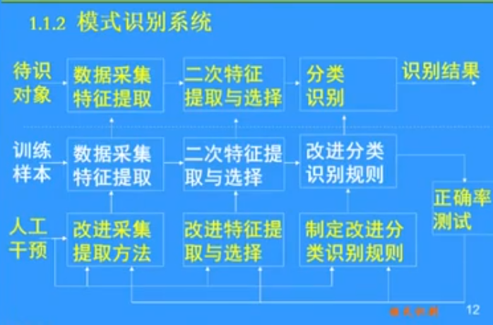
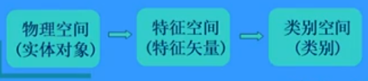
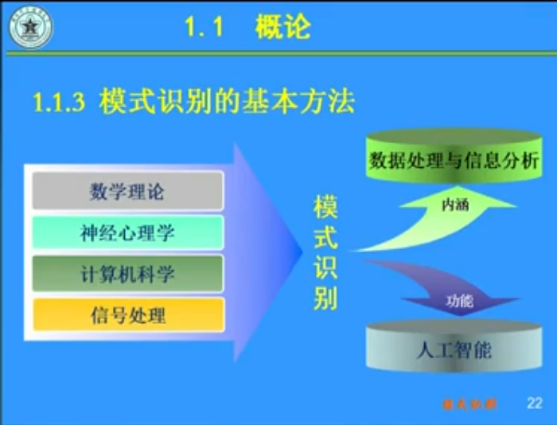

### 1.1.1 模式识别概述

*分类*识别是人类的基本活动之一，相关活动比如：小孩识字、读书看报、人群中找人、医生诊病等等

识别工作变得越来越重要：因为越来越多繁琐和危险的工作需要由机器来完成，所以机器也要具备类似于人的这种识别能力才能进行工作。

*模式（Pattern）*：为了让机器执行和完成识别任务，必须对分类对象进行科学的抽象，建立数学模型，用以描述和代替识别对象，这种东西的描述即为模式。

> 从以上模式的定义可以知道，模式是一种数学模型、是对分类对象的抽象化表示、是对现实世界多种物体具有的相同数学的高度统一化的符号。
> 模式也就是分类对象的数字化表示，在一定的信息采集的基础之上进行。
> 因为我们识别的前提，要有对分类对象的一个抽象化和数字化、信息化的过程，所以叫做模式识别，也就是对其进行抽象化后的描述的识别。（而不叫其样本识别或者是对象识别，因为不同的对象或者是样本可能会有相同的模式）

*表示形式*：特征矢量、符号串、图、关系式

*模式识别（Pattern Recognition）*：根据研究对象的特征或属性，运用一定的分析算法认定其类别，并且其分类的结果应尽可能的符合事实。

> 其实可以看到，模式识别的重点来自于三个步骤：
1. 样本的好坏（挑选样本）：研究对象的特征或属性
2. 算法的好坏（设计算法）：分析算法认定其类别
3. 测试的好坏（挑选好的算法）：分类的结果应尽可能的符合事实

> 总之，模式识别就是让机器实现人可以实现的分类，比如说：具有视觉的机器人、生物特征识别、汽车自动驾驶判别系统、文字语言识别、信件分拣、红膜识别、脸部识别等等

应用领域：智能化、机器学习、知识发现
> 模式识别是人工智能的一个重要分支

### 1.1.2 模式识别系统原理框图
模式识别的*主要过程*是：

学习、训练  --->  分类、识别

模式识别的*核心任务*是：

特征选择与提取  --->  训练学习  --->  分类识别

*重要流程*：

其中：

*数据采集*：是为了实现对分类对象的数字化、信息化

*二次特征提取*：数字化后的信息过多，经过二次选取后，选择对于任务最有效最有帮助的特征

*分类识别*：依靠分类规则，根据特征来进行分类和识别

* 分类规则的建立：要依靠训练样本（已知类别的样本）来进行。
* 分类规则的改进：要利用测试样本对分类规则的准确率进行检测，从而进行改进。

*模式识别过程的层次转换*：从信息层次、形态转换上来讲，是由分析对象的物理空间通过特征提取转换为模式的特征空间，然后通过分类识别转换为输出的类别空间。(有一种层次映射的感觉，最后一层映射到人类想要的最简单的分类识别任务)

如图，在*物理空间*进行初始信息采集、二次特提取后映射到了*特征空间*。

模式识别的*核心问题*：特征选择与提取、学习训练、分类识别

*特征提取（采样数字化）*：对研究对象本质的特征进行量测并将结果数值化或将对象分解并符号化，形成特征矢量、符号串或关系图，产生代表对象的模式。

*特征选择（特征精简化）*：在满足分类识别正确率的条件下，按某种准则尽量选用对正确分类识别作用较大的特征，从而用较少的特征来完成分类识别任务。

1. 模式采集
  A/D转换：在模式采集和预处理中会用到模数转换。
  A/D转换中须注意的两个问题：
  1. 采样率：必须满足采样定理
  1. 量化等级：取决于精度要求（例如：要完成这个人脸识别任务，需要超清的视频还是高清的视频呢？）

1. 预处理
  1. 去噪声：消除或减少模式采集中的噪声及其他干扰，提高信噪比。
  1. 去模糊（夜间、雾天等）：消除或减少数据图像模糊（包括运动模糊）以及几何失真、提高清晰度。
  1. 模式结构转换：例如把非线性模式转换为线性模式（一般线性模式比非线性模式易于处理），以利于后续处理等等。

1. 特征提取/选择
  1. *目的*：降低维数，减少处理消耗，使分类错误比较小。
  1.  从模式空间中选择最有利于模式分类的量作为特征，压缩模式维数，以便于处理，减少消耗。
  * 特征提取一般以分类中使用的某种判决规则为准则，所提取的特征在某种准则下的分类错最少。为此需要考虑特征之间的统计关系，选用适当的正交变换，才能提取出最有效的特征。
  * 特征选择同样需要某种分类准则，在该准则下选择对分类贡献最大的特征，删除贡献较小的特征

*学习训练*：为使机器具有分类识别功能，应首先对它进行训练，将人类的识别知识和方法以及关于分类识别对象的知识输入机器中，产生分类识别的规则和分析程序。

*分类识别*：机器中的分类识别知识与待识别对象越匹配，知识的运用越合理，系统的识别功能越强大、正确率越高。

*分类*：把特征空间划分为类空间
* 把未知类别属性的样本确定为类空间中的某一类型。
* 分类错误率越小越好。
* 分类错误率的分析和计算比较困难。
* 影响分类错误率的因素：分类方法、分类器设计、提取的特征、样本的质量等

### 1.1.3 模式识别的基本方法

*应用举例*：

* 主流技术：统计模式识别、结构模式识别、模糊模式识别、人工神经网络方法、人工智能方法、子空间法。

*统计模式识别*：直接利用各类的分布特征，或隐含地利用概率密度函数、后验概率等概念进行分类识别。
* 基本的技术有:聚类分析、判别类域代数界面法、统计决策法、最近邻法等

*结构模式识别*：将对象分解为若干个基本单元，即基元；其结构关系可以用字符串或图来表示，即句子；通过对句子进行句法分析，根据文法而决定其类别。

*模糊模式识别*：将模式或模式类作为模糊集，将其属性转化为隶属度，利用隶属函数、模糊关系或模糊推理进行分类识别。

*人工神经网络方法*：由大量的基本单元，即神经元相互联接而成的非线性动态系统，在自学习、自组织、联想及容错方面能力强，能用于联想、识别和决策。

*人工智能方法*：研究如何使机器具有人脑功能的理论和方法，故将人工智能中有关学习、只是表示、推理等技术用于模式识别。

*子空间法*：根据各类训练样本的相关通过线性变换由原始模式特征空间产生各类对应的子空间，每个子空间与每个类别一一对应.

### 1.1.4 模式识别的基本原则

1. *没有免费的午餐定理*
  从模式识别的方法来讲，没有哪一种方法在各个方面都表现的很好，在某一方面的优化一定代表另一方面的付出更大的代价（性能的提高意味着代价的更高例如ATM和自动售货机）

1. *丑小鸭定理*
  * 从识别的角度来讲，识别丑小鸭和白天鹅和识别两个天鹅是一样的难度
  * 任何两类的识别，重要点在于特征的选取，而非分类类别的不同

1. *最小描述原理*
  * 模型独立于语言环境（例如一个算法的实现难度与在Python还是C语言环境下编程是无关的）

